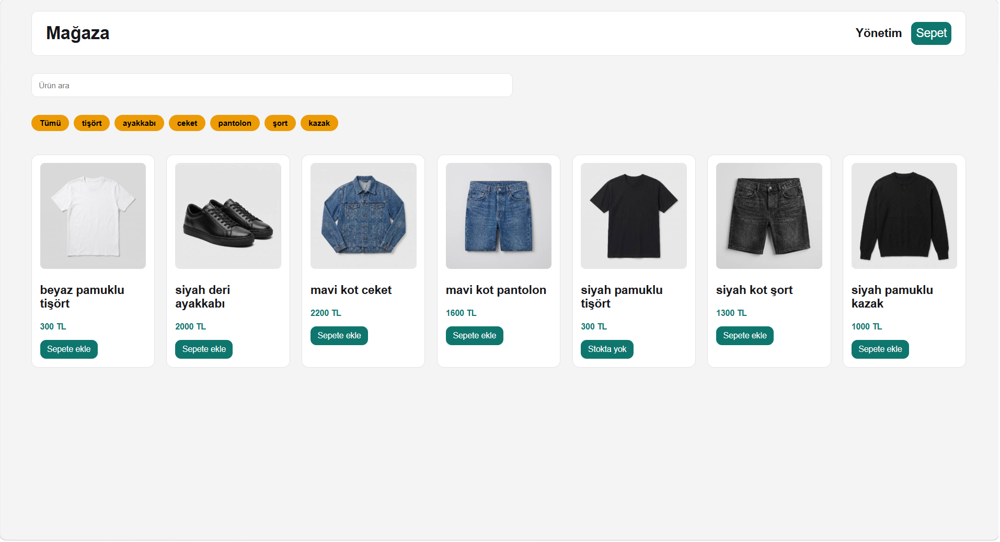
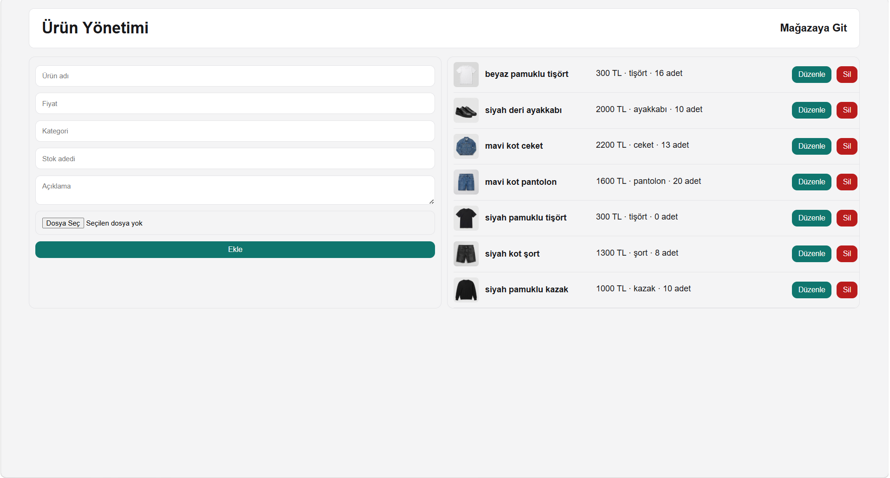

# Ecommerce Store

A small shopping site with a separate admin panel, built with plain HTML, CSS and JavaScript. No frameworks, no build step, no backend — everything runs in the browser and all data is kept in `localStorage`.

I built this to practice DOM manipulation, array methods and browser storage after finishing the basics of JavaScript. The interface text is in Turkish.

**[Live demo](adres)** — the store starts empty; add a few products from the admin panel first.



## What it does

**Store page (`index.html`)**

- Lists all products as cards with image, name and price
- Live search by product name
- Category filter buttons, generated from the products themselves
- Product detail in a modal
- Shopping cart with quantity controls, per-item subtotal and a running total
- Stock limits are enforced when adding to the cart

**Admin panel (`admin.html`)**

- Add, edit and delete products
- Fields: name, price, category, stock, description, image
- Image upload from disk, resized in the browser before saving
- Product list with thumbnails

## How the data works

Both pages share the same `localStorage`, so anything added in the admin panel shows up in the store after a refresh.

Two keys are used:

- `products` — the full product objects
- `cart` — only product ids and quantities

The cart deliberately does not copy product data. Name and price are looked up from `products` when the cart is rendered, so if a price changes in the admin panel the cart reflects it immediately.

## Image handling

`localStorage` has a size limit of about 5MB and only stores text, so uploaded images are converted to base64. A raw photo would use up the whole quota in two or three products.

To avoid that, each image is drawn onto a canvas at 400px wide (keeping the aspect ratio) and exported as JPEG at 0.7 quality before being saved. This brings a typical product photo down to around 30–50KB.

## Running it

Clone the repository and open `index.html` with a local server — VS Code's Live Server extension works. Opening the files directly with `file://` is not reliable, because the two pages need to share the same origin to see the same `localStorage`.

## Limitations

This is a front-end exercise, so a few things a real store would need are missing by design:

- No accounts or authentication — anyone can open the admin panel
- No server, so the data lives in one browser only and is not shared between visitors
- No checkout or payment; stock is checked but never actually reduced
- Clearing browser data wipes everything

## Files

```
index.html      store page
admin.html      admin panel
style.css       styles for both pages
js/storage.js   read/write helpers for localStorage, shared by both pages
js/main.js      store page logic
js/admin.js     admin panel logic
```
